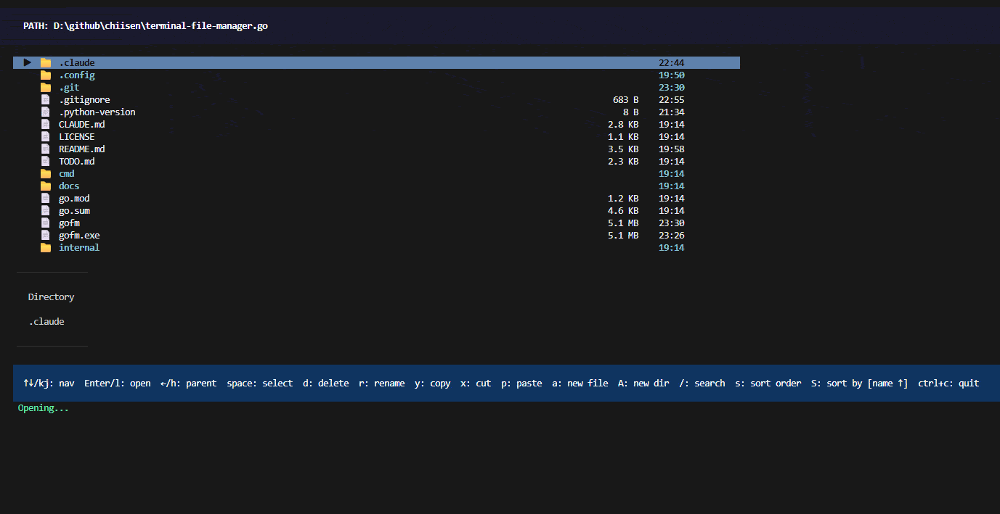

# gofm - Terminal File Manager

[](https://golang.org/)
[](LICENSE)

高效能 Terminal 檔案管理器，使用 Go (Golang) 開發，提供鍵盤導向的檔案瀏覽、操作與管理能力。



## 目標

- 比 GUI 檔案總管更快
- 比 shell ls/cd 更直覺
- 支援大型目錄 (10k+ files)

## 功能特色

### 核心功能
- **檔案導航** - 鍵盤操作 (↑ / Up 上移, ↓ / Down 下移, Enter/l 開啟, h 上一層)
- **檔案操作** - 複製 (y), 貼上 (p), 刪除 (d), 重新命名 (r), 新增檔案/目錄 (a/A)
- **Fuzzy 搜尋** - 按 `/` 進入搜尋模式，即時篩選檔案
  - 搜尋時使用 ↑/↓ 選取結果，Enter 確認並開啟；Esc 還原完整列表，`j/k` 可作為查詢字元輸入。
- **排序功能** - 按 `s` 切換升序/降序，按 `S` 循環切換 (name → size → type → modified)
- **預覽面板** - 選取檔案時自動顯示預覽
  - 文字檔案預覽
  - 圖片資訊 (PNG, JPEG, GIF, BMP, WebP, ICO)
  - 二進制檔案資訊

### 進階功能
- **Git 整合** - 顯示 Git 倉庫變更狀態 (M modified, A added, D deleted)
- **外掛系統** - 支援自訂外掛 (`~/.config/gofm/plugins`)
- **遠端套件（尚未接入 TUI）** - `internal/remote` 提供 SSH/SFTP 目錄讀取、檔案操作及串流下載 API；目前命令列入口僅瀏覽本機路徑。
- **Lazy Load** - 目錄快速載入，非同步載入詳細資訊

### 錯誤處理
- Permission denied 提示
- 檔案刪除後自動刷新
- 損壞的符號連結高亮顯示

## 安裝

```bash
# Clone 後編譯
go build -o gofm ./cmd/gofm
```

## 使用方式

```bash
# 執行 (預設目前目錄)
./gofm

# 指定目錄
./gofm /var/www
./gofm ~/Documents
```

## 遠端功能現況

遠端能力目前供專案內 Go 程式呼叫 `remote.NewRemoteClient` 使用，TUI 尚未提供連線入口；`gofm user@host:/path` 目前不能作為遠端瀏覽指令。

- `Get(remotePath)` 回傳完整小檔案內容；讀取中斷會回傳錯誤，不會把部分內容當作成功。
- `Download(remotePath, writer)` 串流寫入目的地，回傳已寫入的 byte 數與錯誤。下載大檔時可傳入本機檔案 writer，避免把整份內容保留在記憶體中。
- 寫入失敗或連線中斷時，writer 可能已有部分內容；呼叫端應依錯誤決定重試或清理。
- SSH 主機金鑰驗證仍是 `docs/OPEN_QUESTIONS.md` 的獨立待辦；完整遠端 TUI 整合不在這次修正範圍。

## 快捷鍵

| 按鍵 | 動作 |
|------|------|
| ↑ / Up | 上移 |
| ↓ / Down | 下移 |
| Enter / l | 開啟檔案/目錄 |
| h | 返回上一層 |
| d | 刪除 |
| r | 重新命名 |
| y | 複製 |
| x | 剪下 |
| p | 貼上 |
| a | 新增檔案 |
| A | 新增目錄 |
| / | 搜尋 |
| PageUp / PageDown | 捲動預覽 |
| Esc | 關閉預覽／取消輸入或搜尋 |
| s | 切換排序方向 |
| S | 切換排序方式 |
| q | 離開 |

寬視窗以左右面板顯示列表與預覽；窄視窗顯示單一面板，Enter 開啟預覽後可按 Esc 返回列表。面板、通知與快捷鍵列會依視窗尺寸調整。

## 專案架構

```
cmd/gofm/main.go          - 入口點
├── app/app.go            - 主應internal/
用程式 (Bubble Tea Model)
├── fs/                  - 檔案系統操作
│   ├── filesystem.go    - 目錄讀取
│   └── operations.go    - 檔案操作
├── ui/components.go      - UI 元件
├── input/keymap.go       - 鍵位映射
├── preview/preview.go    - 檔案預覽
├── git/git.go            - Git 整合
├── plugin/plugin.go      - 外掛系統
├── remote/remote.go      - SSH/SFTP
├── logger/logger.go     - 日誌系統
├── state/state.go       - 狀態管理
└── types/types.go       - 共用類型
```

## 測試

```bash
# 執行所有測試
go test ./...

# 執行測試並顯示涵蓋率
go test -cover ./...
```

### 涵蓋率

| 套件 | 涵蓋率 |
|------|--------|
| types | 100.0% |
| state | 100.0% |
| git | 84.8% |
| preview | 80.4% |
| ui | 63.6% |
| fs | 81.6% |
| logger | 80.0% |
| plugin | 78.6% |
| input | 49.1% |
| app | 78.3% |
| remote | 44.7% |

> 註：以 `go test -cover ./...`（go1.26.1）量測。部分 UI 分支、鍵位配置與 SSH 握手尚未全部覆蓋；非同步載入、檔案操作、搜尋、Unicode 與 SFTP 串流錯誤等情境已有回歸測試。

## 效能目標

| 指標 | 目標 |
|------|------|
| Startup | < 200ms |
| Navigation | < 16ms |
| Memory | < 50MB |
| Directory render | < 50ms |

## 技術棧

- **Framework**: [Bubble Tea](https://github.com/charmbracelet/bubbletea)
- **Styling**: [Lip Gloss](https://github.com/charmbracelet/lipgloss)
- **SSH/SFTP**: [golang.org/x/crypto/ssh](https://pkg.go.dev/golang.org/x/crypto/ssh), [github.com/pkg/sftp](https://github.com/pkg/sftp)

## License

MIT License - see [LICENSE](LICENSE)
